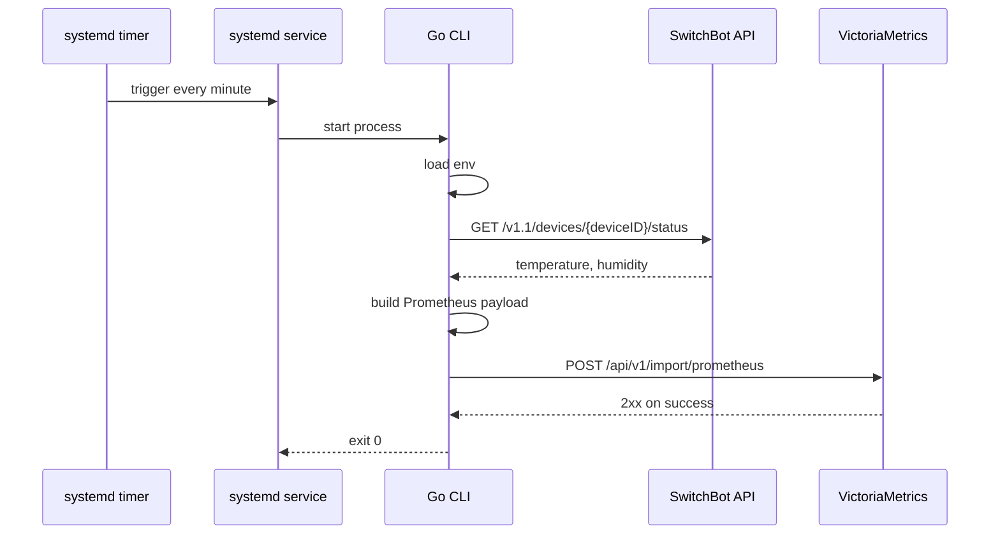

# Architecture

## 目的

このリポジトリは、SwitchBot Meter Plus の温湿度を定期取得し、VictoriaMetrics に保存するための最小構成の監視パイプラインです。

この構成にしている理由は、Raspberry Pi 上で長期間安定して動かすには、常駐プロセスや中間ストレージを増やさず、1 回ごとの取得処理を小さく閉じたほうが運用コストと故障点を減らせるためです。

## システム全体

## コンポーネント

### 1. systemd timer/service

- `nix/modules/nixos/meterplus-to-victoriametrics.nix` が `meterplus-to-victoriametrics` の timer/service を定義します。
- host はその module を import し、service は Nix がビルドした Go バイナリを `Type=oneshot` で 1 回だけ実行します。

この方式を採っている理由は、ポーリング専用の常駐ワーカーを持たずに済み、再起動・障害復旧・ログ確認を systemd に寄せられるうえ、unit 定義と実行バイナリを同じ Nix 世代に閉じ込められるためです。

### 2. Go CLI

- 実体は `cmd/meterplus-to-victoriametrics/main.go` です。
- `nix/packages/meterplus-to-victoriametrics/default.nix` がこのコマンドを package 化し、Pi の store path に配置します。
- 起動時に環境変数を読み込み、SwitchBot API から温湿度を取得し、そのまま VictoriaMetrics に書き込みます。

このプロセスを単一責務にしている理由は、取得と保存の経路を短く保ち、障害時の切り分けを簡単にするためです。現状は 1 デバイスの温湿度転送だけに用途を絞っており、汎用的な収集基盤にはしていません。

### 3. SwitchBot API

- `GET /v1.1/devices/{deviceID}/status` を利用します。
- 認証ヘッダは token, secret, timestamp, nonce から毎回生成します。

毎回 API から最新値を取得する理由は、ローカル状態を持たずに済み、Pi 側で同期やキャッシュ整合性を考えなくてよいためです。

### 4. VictoriaMetrics

- Go CLI は Prometheus text format を `POST /api/v1/import/prometheus` に送信します。
- 保存先を VictoriaMetrics に限定し、別の保存形式への抽象化はしていません。

抽象化を入れていない理由は、このリポジトリの目的が「家庭内メトリクスを VictoriaMetrics に入れること」で明確だからです。保存先を切り替える需要がまだない段階では、汎用化より単純さを優先します。

## アプリケーション内部

## 実行シーケンス

## 設定

必要な設定は SwitchBot 側の環境変数だけです。

- `SWITCHBOT_TOKEN`
- `SWITCHBOT_CLIENT_SECRET`
- `SWITCHBOT_METERPLUS_DEVICE_ID`

VictoriaMetrics の書き込み先は同一ホスト上のローカルインスタンスに固定しています。送信先を host 設定から切り離す理由は、収集先がそのホスト自身で変わらない以上、secret 配布や runtime 設定に含める必要がないためです。

## 設計上の判断

### 常駐型ではなくバッチ型

1 分ごとの取得処理は短時間で完結するため、常駐デーモンより oneshot 実行のほうが故障点が少なくなります。メモリリークや長期接続の劣化も避けやすく、Pi のような小さなホストに向いています。

### 中間キューやローカル永続化を持たない

取得失敗時はその回を失う設計です。これは、家庭内の温湿度監視では完全配送より構成の単純さのほうが価値が高い、という判断に基づいています。

### 1 デバイス専用

現状のコードは 1 台の Meter Plus を前提にしています。複数デバイス対応の抽象化を入れていない理由は、まだ必要が見えていない段階でループ処理や設定形式を複雑化させないためです。

## 障害境界

- SwitchBot API 障害時: メトリクスは書き込まれず、プロセスは失敗終了します。
- VictoriaMetrics 書き込み失敗時: SwitchBot 取得結果は破棄され、プロセスは失敗終了します。
- 設定不足時: 起動直後に失敗します。

失敗時に即終了する理由は、不完全な状態でリトライループや代替経路を抱え込むより、systemd と監視側から異常を見つけやすくするためです。

## 今後の拡張ポイント

- デバイスが増えたら、`environment` を単一デバイス前提から複数定義へ拡張する余地があります。
- メトリクス種別が増えたら、`climateMetricsPayload` を中心に書式を増やせます。
- 可観測性が必要になったら、標準エラー出力に構造化ログを追加できます。

ただし現時点では、KISS/YAGNI を優先し、必要が具体化するまでは抽象化やフォールバックは追加しない方針が適しています。
